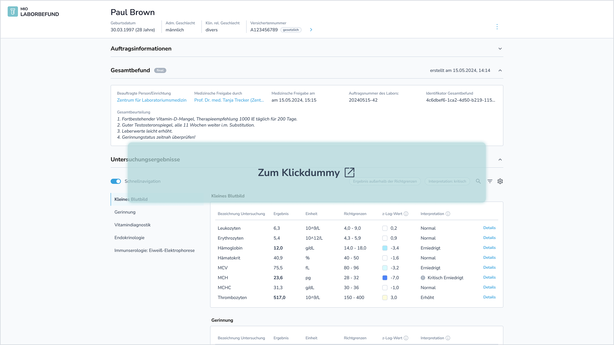

# Einzelbefunddarstellung in der Primärsystemansicht - MIO Laborbefund v1.0.0-update

MIO Laborbefund

Version 1.0.0-update - ci-build 

* [**Table of Contents**](toc.md)
* **Einzelbefunddarstellung in der Primärsystemansicht**

## Einzelbefunddarstellung in der Primärsystemansicht

### Ziel der Visualisierung

Hier sehen Sie eine beispielhafte Darstellung eines Laborbefunds über eine mögliche MIO-Viewer-Komponente. Da nun unter Umständen wesentlich umfangreichere Informationen im Vergleich zu Papier- oder PDF-Befunden transportiert werden, stellt sich die Frage, wie diese im Rahmen eines interaktiven Anzeigemoduls möglichst übersichtlich strukturiert werden können. Zudem gilt es zu klären, welche individuellen Anzeigeeinstellungen sinnvoll sein könnten, um den Nutzenden eine optimale Benutzererfahrung zu bieten.

**[Zum Klickdummy](https://www.figma.com/proto/JQp4kNPlrDefBuhiCRfAzx/Laborbefund?page-id=940%3A19466&node-id=1180-293530&p=f&viewport=481%2C-588%2C0.07&t=MKWr02O9pdmH7prV-1&scaling=scale-down&content-scaling=fixed&starting-point-node-id=1180%3A293530)**

### Wichtigste UX-Thesen

Auf erster Ebene:

* Informationen zum Auftrag und zum Gesamtbefund, jeweils mit Zeitstempel, administrativen Details und ggf. medizinischen Details.
* Pro Untersuchung: Bezeichnung der Untersuchung, Ergebnis, Einheit, Richtgrenzen (ggf. inkl. textbasierter Referenzbereich), Untersuchungsgruppe.
* Pro Untersuchungsgruppe, sofern vorhanden: Interpretation, ergänzende Angaben, Bildanhang.

Optional auf erster Ebene (über Anzeigeeinstellungen konfigurierbar):

* Pro Untersuchung: LCN (Long Common Name zum LOINC**®**), Interpretation, zLog oder Normwertgraphik, Probenart, Gerätbezeichnung, ergänzende Angaben zur Untersuchung, Bildanhang.

Auf zweiter Ebene (in Details):

* Dokumentations- und klinischer Bezugszeitpunkt, Informationen zur medizinischen Freigabe, weitere Details zur Probe und zum Gerät.

Weitere sinnvolle Features:

* Stichwortsuche.
* Filteroptionen u. a. nach auffälligen oder kritisch markierten Werten, aber auch weitere Kriterien entsprechend in der Instanz enthaltener Daten.

