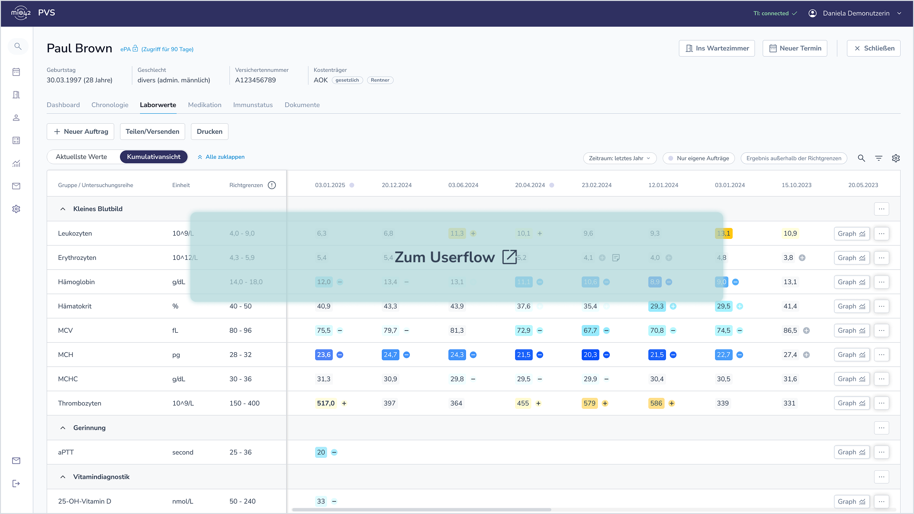

# Kumulativdarstellung in der Primärsystemansicht - MIO Laborbefund v1.0.0-update

MIO Laborbefund

Version 1.0.0-update - ci-build 

* [**Table of Contents**](toc.md)
* **Kumulativdarstellung in der Primärsystemansicht**

## Kumulativdarstellung in der Primärsystemansicht

### Ziel der Visualisierung

Das folgende Beispiel zeigt, wie Laborwerte aus mehreren Befunden – aus unterschiedlichen Laboren – in einer übersichtlichen Ansicht im Praxisverwaltungssystem (PVS) dargestellt werden können. Ziel ist es, eine strukturierte und vergleichbare Darstellung der Werte über verschiedene Zeitpunkte und Quellen hinweg zu ermöglichen – ein entscheidender Mehrwert für die zukünftige Nutzung im Versorgungsalltag. Wir wollen genauer beleuchten, welche Features und Anzeigeeinstellungen auf Endsystemebene hier grundsätzlich hilfreich sein könnten.

Diese Erwartung an die Primärsystemlandschaft im Rahmen der ersten Ausbaustufe sind zugegebenermaßen sehr ambitioniert. Dennoch sind viele Ärzt:innen ähnliche Ansichten zu den Daten ihres Stammlabors im eigenen System gewohnt und erhoffen sich schon mit der Etablierung des MIO Laborbefund eine solche, Labor-unabhängige longitudinale Darstellungsfunktion. Damit dies gelingt, müssen vergleichbare Untersuchungen im MIO Laborbefund mit demselben LOINC® codiert worden sein. Nur so kann das anzeigende Primärsystem diese Untersuchungen verlässlich auf einer Zeile im Verlauf darstellen (s. a. weitere Informationen zu [LOINC®](./Grundlagen_zur_Terminologienutzung.md#untersttzungsleistungen-zur-loinc-einfhrung)).

**[Zum Userflow](https://www.figma.com/proto/JQp4kNPlrDefBuhiCRfAzx/Laborbefund?page-id=1993%3A97617&node-id=2003-78294&p=f&viewport=-2111%2C-40%2C0.33&t=q9wlKVg7OBcaIgFW-1&scaling=scale-down&content-scaling=fixed&starting-point-node-id=2003%3A78294)**

### Wichtigste UX-Thesen

Kumulativansicht und Ansicht über aktuellste Werte

Auf erster Ebene:

* Untersuchungsgruppe, Untersuchungsreihe, Einheit, Richtgrenzen (ggf. inkl. textbasierter Referenzbereich), Ergebnisse der einzelnen Untersuchungen mit Zeitstempel.
* Möglichkeit zum Gesamtbefund zu navigieren.

Optional auf erster Ebene (über Anzeigeeinstellungen):

* Befundersteller:in, Auftraggeber:in, Gesamtbeurteilung, individuelle Richtgrenzen, Interpretation, Abweichung und Markierung, ob ergänzende Angaben vorhanden.

Auf zweiter Ebene (in Details):

* Dokumentations- und klinischer Bezugszeitpunkt, Informationen zur medizinischen Freigabe, weitere Details zur Probe und zum Gerät.
* Möglichkeit zum Gesamtbefund zu navigieren.

Weitere Features:

* Graphische Darstellung der Verläufe.
* Stichwortsuche 
* Filteroptionen, u. a. nach auffälligen oder kritisch markierten Werten oder nach eigenen Aufträgen.
 

### Offene Themen

* Problem der uneinheitlich gruppierten und codierten Untersuchungen: Um die hier gezeigte Übersicht zu ermöglichen, ist eine abgestimmte Art der Codierung auf der LIS-Seite bzw. durch die Labore erforderlich oder eine bestimmte Logik, nach der ungleich codierte, aber vergleichbare Inhalte zusammengeführt werden dürfen. Ein entsprechendes LOINC**®**-Mapping für die Untersuchungscodes sowie eine einheitliche Definition der Gruppen und Einheiten (nach UCUM) könnte das Problem lösen. Aktuell ist geplant, ein solches Mapping schrittweise, zunächst für die meistgenutzten Untersuchungen in Hausarztpraxen zu unterstützen. Dafür haben wir in Abstimmung mit Laborexpert:innen und dem Hausärzte- und Hausärztinnenverband e: V. sowie mit Vertreter:innen der Primärsystemhersteller die sogenannte [Kernliste](./Grundlagen_zur_Terminologienutzung.md#kernliste) entwickelt. Diese Liste enthält häufig angeforderte Untersuchungen in der Labormedizin, die zugleich für Verlaufsansichten relevant sind. Sie dient als Hilfestellung für eine möglichst einheitliche Codierung dieser Analytik. Hierdurch wird eine zuverlässigere Kumulierbarkeit dieser Untersuchungen in anzeigenden Endsystemen mit Daten aus unterschiedlichen Quellen erreichbar.
* Problem der von unterschiedlichen Faktoren abhängigen Richtgrenzen: Jede Untersuchung hat eine individuelle Richtgrenze. Diese exakt abzubilden, würde die Lesbarkeit in der Tabelle stark beeinträchtigen. Vereinfachend sollen nur die Richtgrenzen der jeweils aktuellsten Untersuchung angezeigt werden.
* Weitere Filteroptionen: Zusätzlich zu den bereits gezeigten Filteroptionen könnten weitere Kriterien implementiert werden.
* Möglichkeit, persönliche Anmerkungen auf lokaler Systemebene hinzuzufügen: Dies erlaubt den Nutzenden, den Befunden individuelle Notizen hinzuzufügen.
* Die farbliche Markierung zur Abweichung zu Richtgrenzen in Form von zLog-Werten (s. [Der zlog-Wert als Basis für die Standardisierung von Laborwerten](https://repository.helmholtz-hzi.de/bitstream/handle/10033/621160/Der%20zlog-Wert%20als%20Basis%20f%C3%BCr%20die%20Standardisierung%20von%20Laborwerten.pdf)) ist noch nicht flächendeckend etabliert - die gewohnte Ansicht sind Referenzbalken. Referenzbalken eignen sich jedoch nicht für eine übersichtliche Vergleichsdarstellungen. In Arbeitsgruppen mit Laborbemediziner:innen wurde zLog als sinnvolle Darstellung identifiziert.

