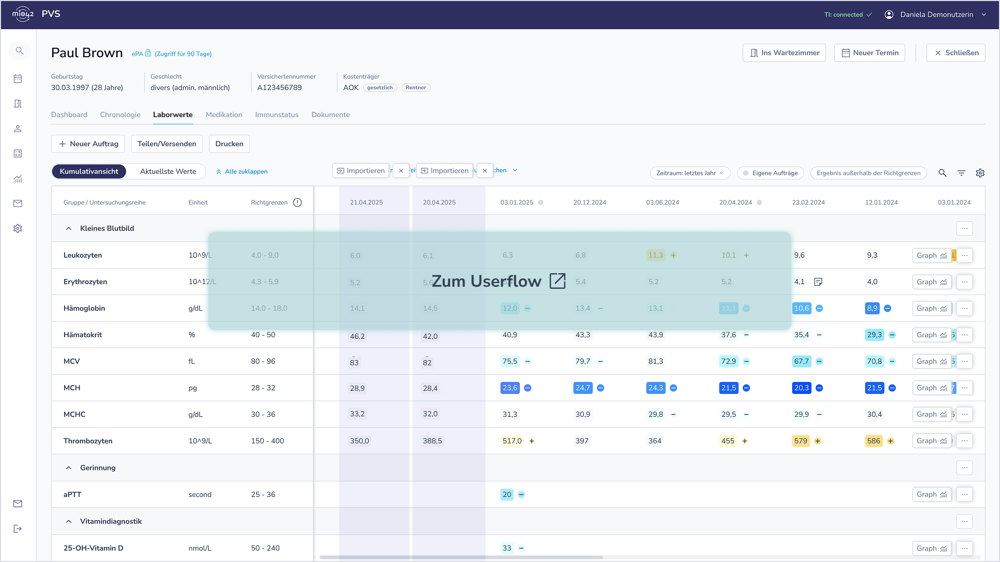

# Mögliche Primärsysteminteraktionen mit der ePA - MIO Laborbefund v1.0.0-update

MIO Laborbefund

Version 1.0.0-update - ci-build 

* [**Table of Contents**](toc.md)
* **Mögliche Primärsysteminteraktionen mit der ePA**

## Mögliche Primärsysteminteraktionen mit der ePA

### Ziel der Visualisierung

Da die Labordaten in der zukünftigen Service-basierten ePA auf einem FHIR-Server gespeichert werden, ergeben sich im Vergleich zur Dokumenten-basierten ePA neue Möglichkeiten und Funktionalitäten. Es stellt sich die Frage, auf welchen Wegen Labordaten aus der ePA in das System gelangen können und wie die neue granulare Durchsuchbarkeit nach bestimmten Kriterien einen Mehrwert für die behandelnde Person (z. B. Hausarzt/Hausärztin) schaffen kann.

**[Zum Userflow](https://www.figma.com/proto/JQp4kNPlrDefBuhiCRfAzx/Laborbefund?page-id=1993%3A97617&node-id=4836-137625&viewport=319%2C445%2C0.1&t=rqtf5c2q7zahRJ1o-1&scaling=scale-down&content-scaling=fixed&starting-point-node-id=4836%3A137625)**

### Wichtigste UX-Thesen

* Importieren von Labordaten aus der ePA: Ermöglicht eine unabhängige Verfügbarkeit der Daten.
* Automatischer Check auf neuere Befunde in der ePA: Die Nutzenden müssen nicht aktiv nach neuen Daten suchen.
* Suchmaske zum freien Durchsuchen der ePA nach Befunden: Bietet die Möglichkeit, gezielt nach bestimmten Kriterien zu suchen.
* Smarte Absprungpunkte zum Durchsuchen der ePA: Erleichtert das Hinzufügen weiterer Labordaten aus der ePA.
* Sichten und Importieren von Befunden via Dokumentenliste in ePA: Gewährleistet eine einfache Übersicht über verfügbare Befunde und die Einordnung in den gesamten Behandlungskontext.
* Vorschau von Befunden in der Kumulativdarstellung: Ermöglicht eine schnelle Einsicht, gefolgt von der Möglichkeit, die Daten zu importieren oder zu verwerfen.

### Offene Themen

* Welche Suchkriterien sind sinnvoll? Hier gilt es, alle relevanten Kriterien zu identifizieren.
* Ist das Herunterladen von einzelnen Untersuchungswerten ohne den gesamten Quellbefund sinnvoll? Diese Frage muss geklärt werden, um sowohl die Benutzerfreundlichkeit zu optimieren als auch die rechtliche Absicherung zu gewährleisten.
* Wäre als erster Schritt eine direkt aus dem Aktensystem generierte XHTML oder PDF-Lösung für die Kumulativanzeige sinnvoll und technisch umsetzbar? Dies könnte eine erste praktische Umsetzung darstellen. Falls dieser Schritt gewünscht ist, wäre eine “Ausgabevorgabe” zu erarbeiten.

